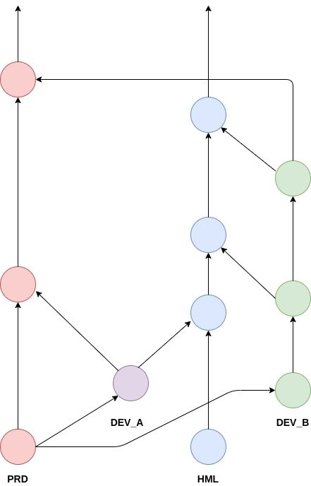
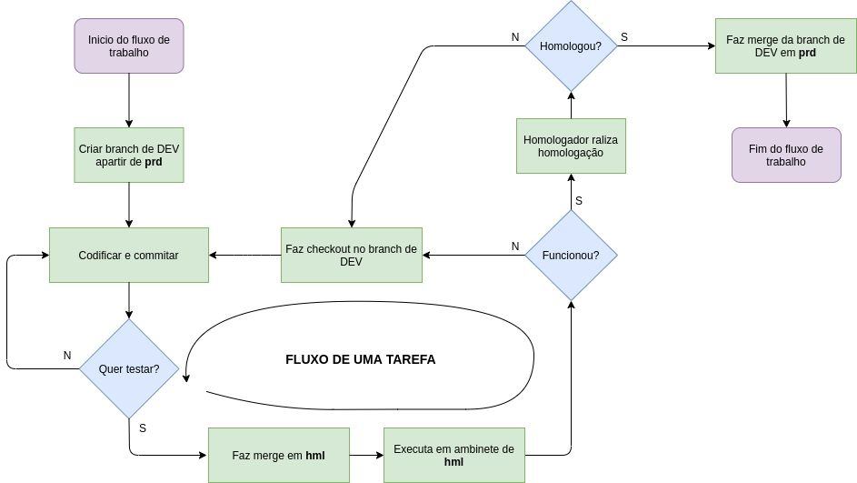

# Gitflow

## Branches

| Branch | Papel |
| --- | --- |
| `prd` | Produção e branch padrão. Recebe apenas branches de DEV homologadas. |
| `hml` | Homologação. Recebe branches de DEV para teste. Nunca é mergeada em `prd`. |
| `<tipo>/<descricao>` | Branch de DEV, sempre criada a partir de `prd`. Tipos: `feature`, `fix`, `hotfix`, `docs`, `chore`, `refactor`, `test`. |



## Fluxo de uma tarefa

1. Criar a branch de DEV a partir de `prd`.
2. Codificar e commitar.
3. Para testar, abrir PR da branch de DEV para `hml` e mergear.
4. Executar no ambiente de `hml`. Se não funcionou, voltar ao passo 2.
5. O homologador valida. Se reprovar, voltar ao passo 2.
6. Homologado, abrir PR da branch de DEV para `prd`.



```bash
git switch prd && git pull
git switch -c feature/minha-tarefa
git push -u origin feature/minha-tarefa
gh pr create --base hml   # teste
gh pr create --base prd   # após homologar
```

Conflito com `hml`: resolver em uma branch temporária criada da branch de DEV (ex.: `feature/minha-tarefa-hml`). Nunca mergear `hml` na branch de DEV.

## Regras no GitHub

- `prd` e `hml`: sem push direto, sem force push e sem exclusão. Merge apenas por PR, com merge commit.
- PR para `prd`: 1 aprovação (homologação) e CI verde.
- PR para `hml`: CI verde.
- A branch de DEV não é apagada ao entrar em `hml`. Apagar após o merge em `prd`.

## CI

Workflow `ci` em cada repositório, nos PRs e pushes para `prd` e `hml`:

- `gitflow`: valida o nome da branch e bloqueia PR para `prd` que contenha commits de `hml`.
- `build`: backend `./gradlew build`; frontend `npm ci`, `npm run lint` e `npm run build`.
