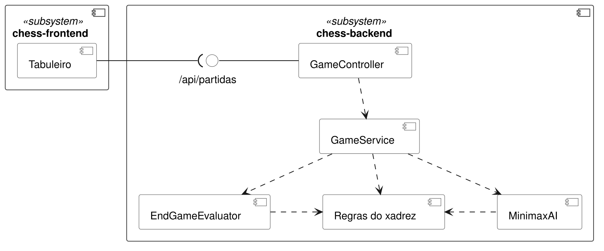
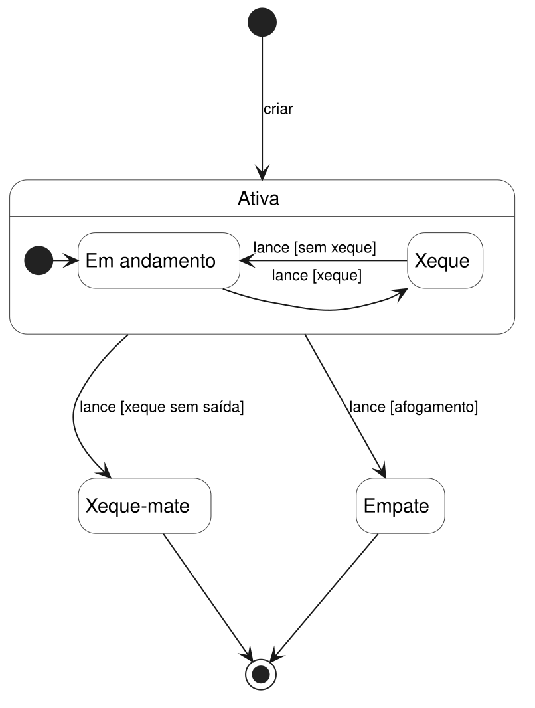

# Diagramas UML

Fontes PlantUML em [`assets/uml/`](../../assets/uml/). Os diagramas incluem funcionalidades ainda em branches de DEV (fim de jogo, IA Minimax e lances especiais).

## Componentes

## Estados da partida

